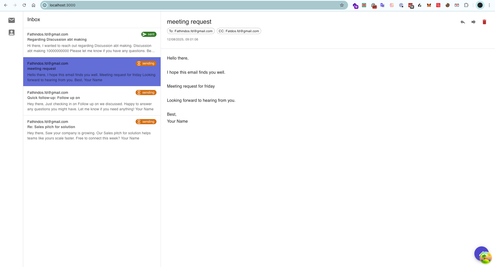

# Running the AI Email Client Application



## Prerequisites
- Node.js installed
- Yarn package manager installed
- Resend API key (optional, for real email sending)

## Email Sending Setup (Optional)
To enable real email sending:
1. Sign up for free at https://resend.com
2. Get your API key from https://resend.com/api-keys
3. Create a `.env` file in the backend directory:
   ```
   RESEND_API_KEY=re_your_api_key_here
   DEFAULT_FROM_EMAIL=onboarding@resend.dev
   ```

## Backend Setup (Terminal 1)
```bash
cd backend
yarn install       # Install dependencies
yarn migrate       # Run database migrations
yarn dev          # Start backend server on port 3002
```

## Frontend Setup (Terminal 2)
```bash
cd frontend
yarn install      # Install dependencies (if not done already)
yarn dev         # Start frontend server on port 3000
```

## Access the Application
- Open your browser and navigate to: http://localhost:3000
- The backend API runs on: http://localhost:3002

## Features Implemented
1. ✅ **Email Sidebar** - Apple Mail style list of emails with status indicators
2. ✅ **Email Viewer** - Display selected email with To, CC, BCC, Subject, and Body
3. ✅ **Compose Email** - Floating action button opens compose dialog
4. ✅ **Real Email Sending** - Send actual emails using Resend API
5. ✅ **Draft & Send Options** - Save as draft or send immediately
6. ✅ **Email Status Tracking** - Draft, Sending, Sent, Failed states
7. ✅ **Email Validation** - Validates email addresses before sending
8. ✅ **AI Integration** - AI ✨ button in compose form
9. ✅ **Router Assistant** - Classifies intent (sales, follow-up, general)
10. ✅ **Sales Assistant** - Generates concise sales emails (40 words max)
11. ✅ **Follow-up Assistant** - Creates polite follow-up emails
12. ✅ **Streaming Support** - Real-time content generation with SSE
13. ✅ **React Query** - Efficient data fetching and caching
14. ✅ **Material-UI** - Modern, responsive design

## Testing the Application
1. Click the compose button (bottom-right corner)
2. Fill in the To and Subject fields (use real email addresses)
3. Click the "AI ✨" chip to use AI assistance
4. Enter a prompt like:
   - "Sales pitch for our new CRM software"
   - "Follow up on our meeting yesterday"
   - "Meeting request for next Tuesday"
5. The AI will classify your intent and generate appropriate content
6. Choose one of:
   - **"Save Draft"** - Saves email to database as draft
   - **"Send Email"** - Sends actual email via Resend API
7. The email will appear in the sidebar with appropriate status badge

## Email Sending Behavior
- **Without Resend API key**: Emails are saved with "failed" status
- **With Resend API key**: Emails are actually sent to recipients
- **Free Resend account**: Can only send from `onboarding@resend.dev`
- **Custom domain**: Configure your domain at resend.com

## Notes
- Emails are saved to a local SQLite database
- The AI generation uses template-based responses (can be replaced with real AI API)
- Email validation ensures proper email format
- All core requirements from the assignment have been implemented